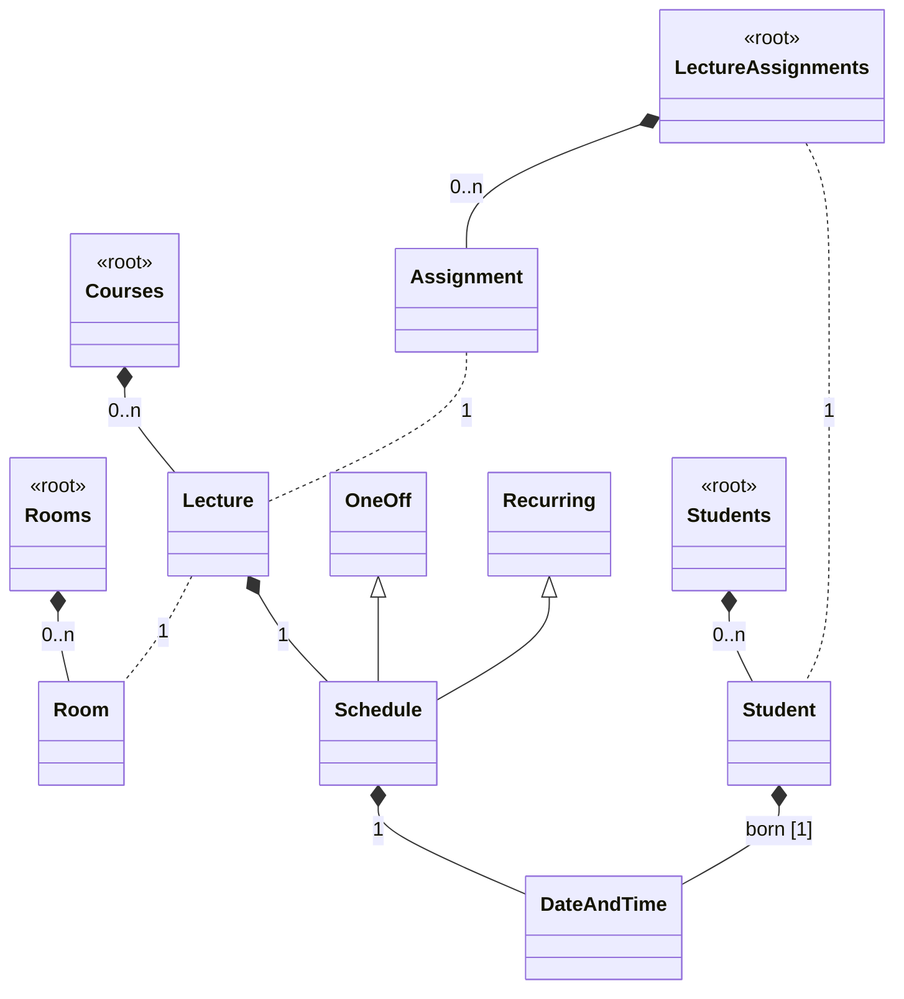

# Some modelix samples

>  ⚠️ **The examples in this repository are currently work in progress** ⚠️

This repository contains a couple of examples that show various aspects of the modelix platform. 
Not all features of modelix are shown here so this is not a complete demo of everything modelix can do.
The primary focus of the examples is to show how you can use modelix to work with language and models defined in 
MPS outside of MPS using plain Java or Kotlin. None of the examples try to reuse editors defined in MPS, if your 
goal is to reuse MPS editors as is then modelix itself ships with a projector integration to achieve this.  

While all the examples use the same language defined in MPS they aren't meant as one complete example
but rather as individual parts. The purpose of the examples is to give inspiration of what is possible with modelix 
and make you think and envision your own use-cases.

## Repository Structure 

The repository is a single gradle project to make building everything at once easy. The examples are then organized in 
the various sub-folders:

| Folder                                                           | Description                                                                                                                                                                           | Status        |
|------------------------------------------------------------------|---------------------------------------------------------------------------------------------------------------------------------------------------------------------------------------|---------------|
| [mps](mps)                                                       | MPS language definition that is used by all examples. The MPS "structure" is used to generate a Java API consumed by all examples.                                                    | done ✅        |
| [University.Schedule.api](mps/solutions/University.Schedule.api) | Generated Java API from the MPS language.                                                                                                                                             | done ✅        |
| [dashboard](dashboard)                                           | A read only dashboard that renders a static HTML page from the MPS models. Implemented in kotlin use ktor. Models are either loaded directly from MPS or from a modelix model server. | WIP ⚠️        |
| [rest-api](rest-api)                                             | A hand crafted API that exposes the model contents as a REST API. Implemented in Java using micronaut.                                                                                | not-started ❌ |
| [web-app](web-app)                                               | A web application that allows editing of MPS models and realtime collaboration. Models are stored in the modelix model server.                                                        | not-started ❌ | 

## Getting Started

To get started with the project we need to set up the gradle project. At the moment most modelix artifacts are stored on
GitHub packages. To access GitHub packaged you need to specify your credentials. First of all you will need to generate 
a [personal access token](https://docs.github.com/en/packages/working-with-a-github-packages-registry/working-with-the-gradle-registry#authenticating-to-github-packages) 
with access to GitHub Packages. The project assumes that your username is available as the variable `gpr.user` and the 
token as `gpr.key`. The easiest way to configure the credentials is copy the example below, paste it into the [`gradle.properties`](gradle.properties)
file in the repository and replace the values with your credentials:

```
gpr.user=<your GitHub login>
gpr.key=<your personal access token>
```

Gradle also supports [other locations](https://docs.gradle.org/current/userguide/build_environment.html#sec:gradle_configuration_properties) for specifying these properties.

After you have set up your credentials you can build all examples via gradle: 
```
./gradlew build # mac/linux

gradlew.bat build # windows
```

Once the initial build has completes feel free to edit the project with the code editor of your choice. 

## The Language 

The language used in all examples is the same. The language itself is fairly small. It describes a very simplified lecture 
schedule. The language intentionally doesn't use expressions, creating editors for expressions by hand is very cumbersome and 
at the time where these samples were created modelix has no support for generating these editors for you.
The main concepts of the language are:

- [Room](http://127.0.0.1:63320/node?ref=r%3Adfa26643-4653-44bc-9dfe-5a6581bcd381%28University.Schedule.structure%29%2F4128798754188010580): 
  where lecture are held. Each room has a maximum capacity of students, a name and some additional properties.
- [Lecture](http://127.0.0.1:63320/node?ref=r%3Adfa26643-4653-44bc-9dfe-5a6581bcd381%28University.Schedule.structure%29%2F4128798754188010560):
  Have a name, some description and reference a room where they are held. And also have a schedule which determines when
  they are held and if they repeat through the whole semester or are a one time lecture.
- [Student](http://127.0.0.1:63320/node?ref=r%3Adfa26643-4653-44bc-9dfe-5a6581bcd381%28University.Schedule.structure%29%2F1648392019017048449):
  A student with a name and birthday.
- [Assignment](http://127.0.0.1:63320/node?ref=r%3Adfa26643-4653-44bc-9dfe-5a6581bcd381%28University.Schedule.structure%29%2F1648392019017048460):
  Lecture assignments for a single student.

Some concepts are contained a root node like a `Rooms` container to make structuring the editors in MPS 
easier: 



## Generated API

In oder to be able to work with the metamodel / structure of the language outside of MPS we need to generate an API that
is usable outside of MPS. This API is generated with the [api-gen](https://github.com/modelix/api-gen) plugin from modelix.
The plugin takes an MPS language definition and exports it into a Java API that wraps around the metamodel independent [model-api](https://github.com/modelix/model-api)
from modelix. The wrapper is than metamodel specific and give you easy access to the instance of your language.

The generator is configured in the `University.Schedule.api` with an [`ApiDefinition`](http://127.0.0.1:63320/node?ref=r%3A86be3a58-5d45-4d2b-aadb-835f83eeb67b%28University.Schedule.api.gen%29%2F8546592165266022808).
When the model that contains the `ApiDefinition` is rebuild it will generate Java classes for the languages that are 
referenced withing it. 

You can find the generated code within the repository at [`mps/solutions/University.Schedule.api/source_gen`](mps/solutions/University.Schedule.api/source_gen)
The generated Java code is then **not** compiled within MPS but using a separate gradle build [here](mps/solutions/University.Schedule.api/build.gradle.kts).
The generated code has no dependency into MPS at all but depends on `org.modelix.mps.api-gen:runtime` which contains a couple
of base classes to make the code generator implementation less convoluted and easier to maintain.

For instance accessing the `rooms` on the `Rooms` root node and then reading the name of the `Room` using the modelix 
model api directly would look like this: 

```kotlin
val iNode : INode = ...
iNode.getChildren("rooms").forEach { it.getPropertyValue("name") }
```

You can see that this is quite error-prone because every access to a child role or property is just a string. If you have a 
typo or the structure of the language changes you will only notice it at runtime.

Using the generated API the same code looks like this:

```kotlin
val iNode : INode = ...
val rooms = MPSLanguageRegistry.getInstance<Rooms>(iNode)
rooms.children.rooms.forEach { it.properties.name }
```

The code generator has exported the language definition, and we can use to write type safe code that works 
with the models. For properties and children we now have attributes in the generated classes and if somebody renames a 
property or child-role the compiler will tell us. Of course the `MPSLanguageRegistry.getInstance<Rooms>` would throw an exception if our `iNode` instance 
isn't a `Rooms` instance. 

The generate class for a the [`Room`]() concept: 

```
concept Room extends BaseConcept                                                                                                                                                          
             implements INamedConcept                                                                                                                                                     
                                                                                                                                                                                          
instance can be root: false 
alias: <no alias> 
short description: <no short description> 
 
properties: 
maxPlaces : integer
hasRemoteEquipment : boolean         
 
children: 
<< ... >> 
 
references: 
<< ... >>                                                                                                                                                                              
```


<details>
<summary>
Will look like this:
</summary>

```java
package University.Schedule.structure;

/*Generated by MPS */

import jetbrains.mps.lang.core.structure.BaseConcept;
import jetbrains.mps.lang.core.structure.INamedConcept;
import org.modelix.mps.apigen.runtime.INodeHolder;
import org.jetbrains.annotations.NotNull;
import org.modelix.model.api.INode;
import org.jetbrains.annotations.Nullable;

/**
* Generated for http://127.0.0.1:63320/node?ref=r%3Adfa26643-4653-44bc-9dfe-5a6581bcd381%28University.Schedule.structure%29%2F4128798754188010580
  */
  public class Room extends BaseConcept implements INamedConcept {

public class Properties extends BaseConcept.Properties implements INodeHolder, INamedConcept.Properties {

    @NotNull
    @Override
    public INode getINode() {
      return Room.this.getINode();
    }
    @Nullable
    public Integer getMaxPlaces() {
      String propertyValue = getINode().getPropertyValue("maxPlaces");
      if (propertyValue != null && !(propertyValue.isEmpty())) {
        return Integer.parseInt(propertyValue);
      }
      return null;
    }
    @Nullable
    public Integer setMaxPlaces(Integer value) {
      if (value != null) {
        getINode().setPropertyValue("maxPlaces", Integer.toString(value));
      } else {
        getINode().setPropertyValue("maxPlaces", null);
      }
      return value;
    }
    @Nullable
    public Boolean getHasRemoteEquipment() {
      String propertyValue = getINode().getPropertyValue("hasRemoteEquipment");
      if (propertyValue != null && !(propertyValue.isEmpty())) {
        return Boolean.parseBoolean(propertyValue);
      }
      return null;
    }
    @Nullable
    public Boolean setHasRemoteEquipment(@Nullable Boolean value) {
      if (value != null) {
        getINode().setPropertyValue("hasRemoteEquipment", Boolean.toString(value));
      } else {
        getINode().setPropertyValue("hasRemoteEquipment", null);
      }
      return value;
    }
}
public class Children extends BaseConcept.Children implements INodeHolder, INamedConcept.Children {

    @NotNull
    @Override
    public INode getINode() {
      return Room.this.getINode();
    }
}
public class References extends BaseConcept.References implements INodeHolder, INamedConcept.References {

    @NotNull
    @Override
    public INode getINode() {
      return Room.this.getINode();
    }


}

private final Properties properties;
private final Children children;
private final References references;
public Room(INode node) {
super(node);
this.properties = new Properties();
this.children = new Children();
this.references = new References();
}
public Properties getProperties() {
return this.properties;
}
public Children getChildren() {
return this.children;
}
public References getReferences() {
return this.references;
}
}

```

</details>

### Limitations 

At the moment it's not possible to regenerate the API as part of the CI/gradle build, that's why the generated sources 
are checked into the repository.  **This limitation is specific this example** and is somehow caused by the MPS build failing 
to load the right languages during the build. Other projects are successfully using the `api-gen` code generator within 
their CI/gradle build.  The limitation will get fixed in the future but for now the generated Java
code is checked into the repository.

## Dashboard

The idea here is to illustrate read only use cases where a system/service outside of
MPS wants to consume the content of models defined in MPS.

The dashboard is a simple application that contains a webserver that serves static HTML rendered from a model. A user can 
not edit that models from the browser. The imaginary use-case is a display next to the room that show the upcoming lectures 
in that room or a display in the main hall showing all the lectures of the current day. 

The dashboard application is written in Kotlin and uses [Ktor](https://ktor.io) as a webserver, [tailwind.css](https://tailwindcss.com) for styling and the generated API 
from the language. By default, the dashboard will try to load the models from an MPS instance running on your local machine. 
To get access to the models within your MPS it is using the [`mps-rest-model-access`](https://github.com/modelix/mps-rest-model-access) component from modelix.

### Running the Dashboard

Before running the actual dashboard you need to open the MPS project in the [`mps`](mps) folder. This will set up MPS with
the `mps-rest-model-access` plugin and expose your models via an HTTP API. This API is then accessed from the dashboard 
application to load the models. 

Once your MPS project is opened you can run the dashboard: 

```
./gradlew dashboard:run
```

Once you see a log message like:
```
11:12:41.672 [ktor-cio-dispatcher-worker-1] INFO ktor.application - Responding at http://0.0.0.0:8090
```

Your dashboard is ready you can point your browser to http://localhost:8090 to view the dashboard.

### Details on the Dashboard Application

The Kotlin code for the dashboard features extensive code documentation that explains the various parts and how they are 
connected. 

### Deploying to Docker / Kubernetes 

> ⚠️ TBD
