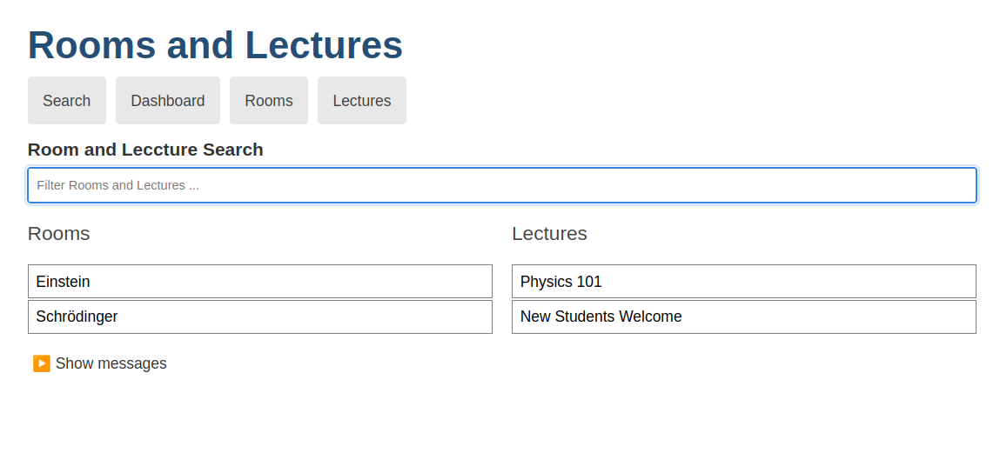
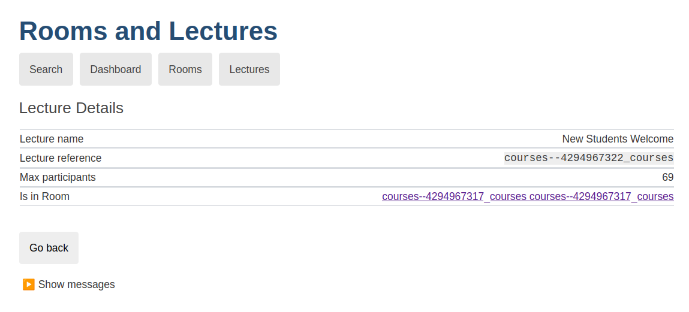

# Single page application: An angular based dashboard

[](doc/spa-sample-1.png)
[](doc/spa-sample-2.png)

This project provides a single page application which accesses an implementation of this projects [openapi](../openapi/openapi.yaml).

The idea here is to illustrate a read only use case where a system/service outside of MPS wants to consume the content of models defined in MPS.
This dashboard is a simple application that serves static HTML obtained from the intermediate openAPI.
A user can not edit that models from the browser. 


## Building & Running

### 1. Build `spa-dashboard-angular`

You can build this subproject individually from the parent folder via  all examples via gradle:
```
./gradlew spa-dashboard-angular:build
```

### 2. Start an openAPI implementation

To run this application you will need a component which provides the corresponding REST API conforming to the openAPI spec.
Before you can start the application, you need to start one of the available openAPI implementations.
Thus, you can either start the [rest-api-json-bulk](../rest-api-json-bulk)) implementation, or alternatively you can start the [rest-api-model-server](../rest-api-model-server) implementation.
Check the README of the corresponding project on how to start them.

**Note**: Make sure you have the correct ports defined [in the API URLs](src/app/Container.ts). This app expects `8080` by default.

### 3. Run the angular app

Next run this single page application via:

```
./gradlew spa-dashboard-angular:npmRun
```

You can then go to `http://localhost:4200` to see a dashboard with the courses model content.